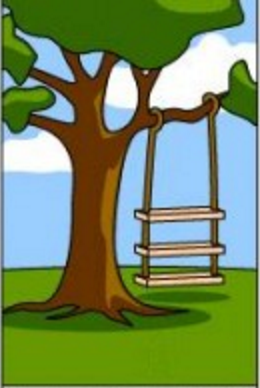
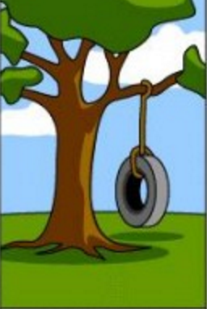
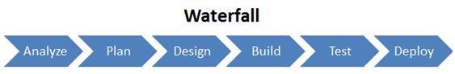
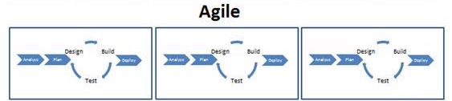
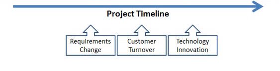
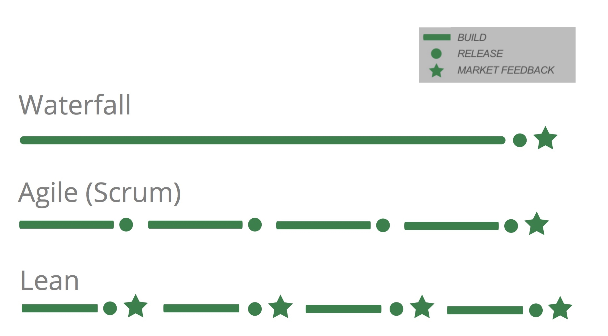

class: center, bottom
background-image: url(./img/bg-developer.jpg)
<!-- https://www.pexels.com/photo/couch-conference-concentration-startup-7111/ -->

# .white-on-black[ How to make a startup product efficiently, as a solo developer with Meteor.js ]

### .white-on-black[ NUMA Sprint Bootcamp 2016 ]

<!-- Press P to toggle Presenter mode, and display presenter notes below: -->

???

*Press C to open a synchronized clone view, for the audience (projector/beamer screen)*

Synopsis:

- This is the story of my latest freelance project for a startup company.
- I explain why:
  - I chose Meteor to do it,
  - how fast it works,
  - how I convinced by client to use the Agile methodology
  - and how I applied it as a solo developer on their ambitious startup product.

---
background-image: url(./img/bg-developer.jpg)

# Summary

1. Why Agile?
1. Why Meteor?
1. How to Meteor?
1. How to Agile?

<!-- - - - - - - - - - - - - - - - - - - - - - - - - - - - - - - - - - - -->

---
class: center, middle, inverse

# 1. Why Agile?

Or, why waterfalls suck.

???

- waterfall project vs agile project, the point of view of the developer
- waterfall project vs agile project, a business-friendly explanation
- why agile in solo?

---

# From startup idea to software

.col-25pct[ .wide[] .center[How the CEO explained it] ]
.col-25pct[ .wide[] .center[How the web agency understood it] ]
.col-25pct[ .wide[] .center[How the developer coded it] ]
.col-25pct[ .wide[] .center[What the startup actually needs] ]

---

# The Waterfall problem

.col-25pct[
  .wide[]
]
.col-25pct[
  .center.bold[ Startup: ]
  - wrote specs
  - set a deadline
  - delegated to the developer
]

--

.col-25pct[
  .wide[]
]
.col-25pct[
  .center.bold[ Developer: ]
  - (mis)interpreted the specs
  - avoided/reduced communication, to save time
]

--

.clear-block[]
.center.bold.margin-20px[
  => The resulting product does not comply to the startup's needs

  => Waste of time and money
]

---

# From Waterfall to Agile

.center[]
--
.center[]
--
.center[]

---

# From Waterfall to Agile to Lean Startup

.wide[]

---
class: right
background-image: url(./img/bg-runner.jpg)
<!-- https://www.pexels.com/photo/red-people-outside-sport-2207/ -->

# .white-on-black[ Agile for solo developer? ]

???

Oui, car utiliser une méthode agile permet de:

- maintenir un backlog
- développer le produit étape par étape
- découper les fonctionnalités en petites taches (user story cards)
- forcer l'estimation/chiffrage de chaque tache => décision possible
- retrospective: améliorer le process à chaque fin de sprint

<!-- - - - - - - - - - - - - - - - - - - - - - - - - - - - - - - - - - - -->

---
class: center, middle, inverse

# 2. Why Meteor?

Compared to other technologies

???

- quick panel of existing languages/technologies for building web products; their pros and cons
- from javascript/node to meteor, and why meteor is great for bootstrapping and evolving a product

---

# .absolute[ Trends of Web Technologies ]

.footnote[ \* *This just illustrates my point of view* ]

---

# 

- Since 2012, free and open-source
- **RoR-inspired** framework for rapid application development
- **Universal Javascript**: same language on front-end and back-end
- Make **web and mobile** apps from the same codebase
- **Reactive**/real-time rendering
- **Modern stack**: Node.js, MongoDB, React or Angular
- 9900+ Full-stack packages => **productivity**

---

#   - Example

.center[
  <iframe id="ytplayer" width="640" height="360" src="https://www.youtube.com/embed/OtlO2NAq9fg?rel=0&amp;controls=0&amp;showinfo=0&amp;start=67&amp;end=90&amp;enablejsapi=1" frameborder="0" allowfullscreen></iframe>

  E-commerce website done by a beginner in 2 weeks.
]

<!-- - - - - - - - - - - - - - - - - - - - - - - - - - - - - - - - - - - -->

---
class: center, middle, inverse

# 3. How to Meteor?

Coding a startup product from scratch

???

- chronological (live-coding-like) summary of how I built the product efficiently using meteor packages
- some problems found during development, and how I handled them

---

# Sprint 1: *"a client can buy a product"*

In 30 hours of development:

- user signup/login (out of the box)
- responsive design (bootstrap)
- display a list of products
- payment (stripe)
- confirmation emails (sendgrid)
- deployed in 2 minutes on a \*.meteor.com URL
- onboarding form with material design
- automated tests (chimp)
- extra time: added a wishlist feature

--

.gray[ Packages&#58; flow-router, accounts-password, bootstrap, bootstrap-3-modal, toastr, collection2, autoform, collection-helpers, collection-hooks, stripe, email ]

---

# Sprint 2: *"a client can rent a specific product"*

In 30 hours of development:

- search & filters
- subscriptions (stripe)
- account deletion
- design integration

--

.gray[ Packages&#58; autoform-materialize, persistent-session, owl-carousel, slideout ]

---

# Sprint 3: *"a client can book products in advance"*

In 30 hours of development:

- user management
- booking/stock management
- ui/ux improvements

--

.gray[ Packages&#58; moment ]

---

# Sprint 4: *"the admin can manage users and bookings"*

In 30 hours of development:

- back-office
- ui/ux improvements
- pre-production (scalingo)
- landing page on startup's domain name

--

.gray[ Packages&#58; roles, flow-db-admin ]

---
class: center
background-image: url(./img/bg-success.jpg)

<!-- https://www.pexels.com/photo/landscape-mountains-nature-man-1005/ -->

# .blurred-bg.highlight[ Achievements ]

.col-50pct.pull-left[
  .blurred-bg.highlight[ A fully-functional, ]

  .blurred-bg.highlight[ mobile-first, ]

  .blurred-bg.highlight[ 100% custom ]

  .blurred-bg.highlight[ e-commerce website, ]

  .blurred-bg.highlight[ developed in 4 weeks. ]
]

--

.col-50pct.pull-left[
  .blurred-bg.highlight[ Thanks to: ]

  .blurred-bg.highlight[ \- Meteor technology ]

  .blurred-bg.highlight[ \- Agile methodology ]
]

<!-- - - - - - - - - - - - - - - - - - - - - - - - - - - - - - - - - - - -->

---
class: center, middle, inverse

# 4. How to Agile?

Interactions between product owner and developer

???

- how I split up the work into sprints
- what were the deliverables and input/reference documents that I asked to the client
- what worked great, what could have been better => advice for numa startups
