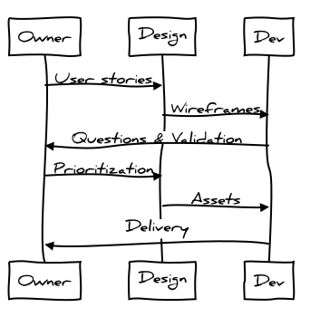
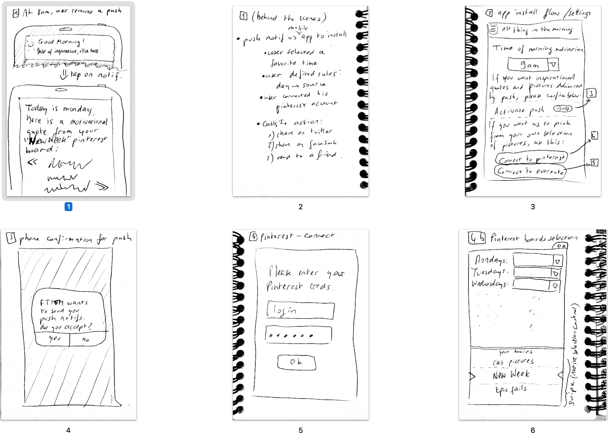
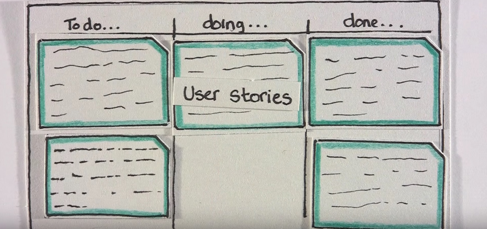
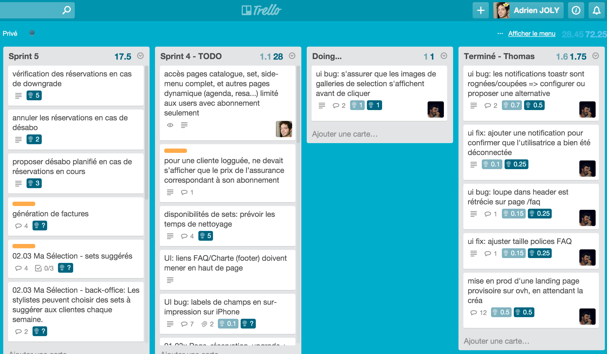

class: center, bottom, full-bg-image
background-image: url(./img/bg-developer.jpg)
<!-- https://www.pexels.com/photo/couch-conference-concentration-startup-7111/ -->

# .white-on-black[ How to make a startup product efficiently, as a solo developer with Meteor.js ]

### .white-on-black[ @adrienjoly, NUMA Sprint Bootcamp 2016 ]

<!-- Press P to toggle Presenter mode, and display presenter notes below: -->

???

*Press C to open a synchronized clone view, for the audience (projector/beamer screen)*

- Adrien Joly, developpeur et enseignant javascript.
- freelance après 4 ans comme lead dev en startup, chez whyd.
- continué à travailler avec des startups, notamment ici. => bcp appris
- partager quelques enseignements et tuyaux utiles pour vous.

---
class: full-bg-image
background-image: url(./img/bg-developer.jpg)

# Summary

1. Why Agile?
1. Why Meteor?
1. How to Meteor?
1. How to Agile?

???

- This is the story of my latest freelance project for a startup company.
- I explain why:
  - I chose Meteor to do it,
  - how fast it works,
  - how I convinced by client to use the Agile methodology
  - and how I applied it as a solo developer on their ambitious startup product.

<!-- - - - - - - - - - - - - - - - - - - - - - - - - - - - - - - - - - - -->

---
class: center, middle, inverse

# 1. Why Agile?

Or, why waterfalls suck.

???

- problèmes classiques de projets de développement: waterfall
- waterfall vs agile
- quel rapport avec le lean startup?
- agile in solo?

---

# From startup idea to software

.col-25pct[ .wide[] .center[How the CEO explained it] ]

???
une histoire (trop) classique de projet logiciel:
- logiciel / site / app => automatisation d'un process => savoir définir le process, avec tous ses cas non prévus. (plus compliqué qu'on le croit)

--
.col-25pct[ .wide[] .center[How the web agency understood it] ]

???
- pitch + envie de plaire à tout le monde => course aux features => explications imprécises => confusion de l'équipe de développement qui doit interpréter pour comprendre les besoins

--
.col-25pct[ .wide[] .center[How the developer coded it] ]

???
- enfin, développeur: problèmes techniques, deadines => "best effort"

--
.col-25pct[ .wide[] .center[What the startup actually needs] ]

???
- à la fin on se rend compte que nos clients/utilisateurs se seraient contentés de quelque chose de bcp plus simple, mais qui marche

---

# The Waterfall problem

.col-25pct[
  .wide[]
]
.col-25pct[
  .center.bold[ Startup: ]
  - wrote specs
  - set a deadline
  - delegated to the developer
]

???
autopsie de ce projet maudit:
- la startup essaye d'expliquer de quoi elle a besoin => specs
- elle veut que ça aille vite => deadline
- le CEO est busy => le développeur doit savoir se débrouiller

--
.col-25pct[
  .wide[]
]
.col-25pct[
  .center.bold[ Developer: ]
  - (mis)interpreted the specs
  - avoided/reduced communication, to save time
]

???
du coup:
- le dev a mal interprété les specs
- il a pris des raccourcis pour respecter la deadline

--
.clear-block[]
.center.bold.margin-20px[
  => The resulting product does not comply to the startup's needs

  => Waste of time and money
]

???
=> le résultat ne convient pas aux attentes. => perte de temps

---

# From Waterfall to Agile

.center[]

???
type projet = waterfall (cascade):
- process lineaire, ce qui sort à la fin est décrit au début
- on évite de revenir en arrière, pour ne pas exploser la deadline
- l'équipe bosse en mode "tunnel" => on verra ce qui sort à la fin

--
.center[]

???
alternative: Agile/scrum:
- on y va étape par étape => on enchaine des "itérations" (spec + design + dev)
- chaque itération -> résultat fonctionnel/testable. => pas d'effet tunnel

--
.center[]

???
Méthode adaptée aux startups car specs évoluent en permanence => rassurant pour tout le monde

---

# From Waterfall to Agile to Lean Startup

.wide[]

???
- différence entre agile et lean? les retours des utilisateurs
- en agile, on se contente de livrer des fonctions à chaque sprint
- en lean, on mesure le retour sur investissement de chaque étape

---
class: right, full-bg-image
background-image: url(./img/bg-runner.jpg)
<!-- https://www.pexels.com/photo/red-people-outside-sport-2207/ -->

# .white-on-black[ Agile for solo developer? ]

???
Oui, car méthode agile:
- maintenir un backlog
- développer étape par étape
- découper fonctionnalités en petites taches
- estimation/chiffrage des tache => décision
- retrospective: amélioration process

=> questions?

<!-- - - - - - - - - - - - - - - - - - - - - - - - - - - - - - - - - - - -->

---
class: center, middle, inverse

# 2. Why Meteor?

Compared to other technologies

???
- panel of languages/technologies for building web products => pros+cons
- javascript/node -> meteor
- why meteor is great for bootstrapping and evolving a product

---

# .absolute[ Trends of Web Technologies ]

.footnote[ \* *This just illustrates my point of view* ]

???
- pas troll: mon pt de vue
- axes: agilité vs hype
- agilité => capacité à créer/casser efficacement
- hype => beaucoup de devs motivés sur le marché
- React = hype mais /!\ courbe apprentissage
- Node -> confiance, mais bcp trop de possibilités (vs ruby)
- Meteor: stack node avec raccourcis inspirés de ruby

---

# 

.center[
  <iframe id="ytplayer" width="640" height="360" src="https://www.youtube.com/embed/OtlO2NAq9fg?rel=0&amp;controls=0&amp;showinfo=0&amp;start=67&amp;end=90&amp;enablejsapi=1" frameborder="0" allowfullscreen></iframe>

  E-commerce website done by a beginner in 2 weeks.
]

???
- Pourquoi si rapide?
- code front mêlé avec code back
- packages: bootstrap, paiement, composants graphiques...

---

# 

- Since 2012, free and open-source
- **RoR-inspired** framework for rapid application development
- **Universal Javascript**: same language on front-end and back-end
- Make **web and mobile** apps from the same codebase
- **Reactive**/real-time rendering
- **Modern stack**: Node.js, MongoDB, React or Angular
- 9900+ Full-stack packages => **productivity**

???
=> Des questions?

<!-- - - - - - - - - - - - - - - - - - - - - - - - - - - - - - - - - - - -->

---
class: center, middle, inverse

# 3. How to Meteor?

Coding a startup product from scratch

???
- chronological/live-coding summary/story
- how I built the product efficiently using meteor packages
- pour vous donner une idée/échelle de temps

---
class: right-bg-image
background-image: url(./img/panoply-screen-1.jpg)

# .highlight.blurred-bg[ Sprint 1: *"a client can buy a product"* ]

In 30 hours of development:

- user signup/login
- responsive design
- list of products
- payment
- confirmation emails
- automated tests
- extra: wishlist feature
- deployed online in 2mn

???
- objectif 1er sprint: rassurer et impressionner le client
- fonctionnalités essentielles e-commerce
- feat. login, paiement, emails, tests => en ligne

--

.col-50pct.gray[
  Packages&#58; flow-router, accounts-password, bootstrap, bootstrap-3-modal, toastr, collection2, autoform, collection-helpers, collection-hooks, stripe, email
]

???
- bcp de packages au début, ça va se calmer

---
class: right-bg-image
background-image: url(./img/panoply-screen-2.jpg)

# .highlight.blurred-bg[ Sprint 2: *"a client can rent a specific product"* ]

In 30 hours of development:

- search & filters
- subscriptions (stripe)
- account deletion
- design integration

???
- etape 2: on rafine le business: location, recherche
- integration des ecrans du designer
- à noter que designer désynchronisé des mes sprints

--

.col-50pct.gray[
  Packages&#58; autoform-materialize, persistent-session, owl-carousel, slideout
]

???
- ici j'ai surtout ajouté des composants graphiques

---
class: right-bg-image
background-image: url(./img/panoply-screen-3.jpg)

# .highlight.blurred-bg[ Sprint 3: *"a client can book products in advance"* ]

In 30 hours of development:

- user management
- booking/stock management
- ui/ux improvements

???
- etape 3: fignolage UI et gestion
- le fignolage prend souvent bcp de temps, car bcp de details
- et c'est plus facile à voir par les non-tech
- avantage agile: on peut toujours faire mieux, si le client paye!

--

.gray[ Packages&#58; moment ]

???
- packages: gestion de dates (complexe)

---
class: right-bg-image
background-image: url(./img/panoply-screen-4.jpg)

# .highlight.blurred-bg[ Sprint 4: *"the admin can manage users and bookings"* ]

In 30 hours of development:

- back-office
- ui/ux improvements
- pre-production (scalingo)
- landing page on startup's domain name

???
- etape 4: penser à la mise en prod
- /!\ dns prend 24h
- bien choisir un hébergeur correspondant a la stack

--

.gray[ Packages&#58; roles, flow-db-admin ]

???
- packages liés à l'administration / back office

---
class: center, full-bg-image
background-image: url(./img/bg-success.jpg)

<!-- https://www.pexels.com/photo/landscape-mountains-nature-man-1005/ -->

# .blurred-bg.highlight[ Achievements ]

.col-50pct.pull-left[
  .blurred-bg.highlight[ A fully-functional, ]

  .blurred-bg.highlight[ mobile-first, ]

  .blurred-bg.highlight[ 100% custom ]

  .blurred-bg.highlight[ e-commerce website, ]

  .blurred-bg.highlight[ developed in 4 weeks. ]
]

???
Bilan:
- site fonctionnel, mobile, sur mesure, avec paiement, en 4 semaines
- executé en agile

--

.col-50pct.pull-left[
  .blurred-bg.highlight[ Thanks to: ]

  .blurred-bg.highlight[ \- Meteor technology ]

  .blurred-bg.highlight[ \- Agile methodology ]
]

???
Au départ inquiet, le client:
- a compris l'intérêt du projet agile
- a apprécié l'efficacité du dev avec meteor

=> Questions ?

<!-- - - - - - - - - - - - - - - - - - - - - - - - - - - - - - - - - - - -->

---
class: center, middle, inverse
# 4. How to Agile?

Interactions between product owner and developer

???
Maintenant qu'on a vu intérêt bosser en agile + utiliser meteor:
- comment agile fonctionne
- split work into sprints
- what deliverables from me
- what input/reference docs from client

=> practical tips for startups

---
# Anatomy of an agile Sprint

.center[  ]

???
- zig-zag entre client, designer et dev
- client fournit user stories
- designer produit des wireframes
- dev pose questions "génantes" (anomalies, ambigu., faisab.)
- client priorise
- dev implémente avec assets du designer
- puis on release

=> on va voir chaque étape de plus près

---
class: full-bg-image
background-image: url(./img/user-story-card-1.jpg)
# .highlight.blurred-bg[ Unit = User Story Card ]

???
- en agile: pas de specs. -> user stories
- user story = fonction vue par un acteur, avec une finalité
- par exemple...

---
class: full-bg-image
background-image: url(./img/user-story-card-2.jpg)

???
...
- *le restaurateur saisit son plat du jour, pour informer les visiteurs*
- *le visiteur crée un compte client, pour commander un plat*
- *le client règle en ligne, pour commander un plat livré à domicile*
- *le restaurateur est informé de la commande, pour livrer le client*
- ...

---
# Designing Wireframes from stories

.wide[  ]

???
Sur la base des user stories, le designer:
- dessine des esquisses d'écrans pour permettre ces fonctions
- /!\ pas encore de photoshop, ni HTML => on dessine pour proposer idées
- parfois plusieurs possibilité => discussion avec client/CEO et dev
- dev peut influencer en signalant des anomalies/difficultés tech

---
class: left-bg-image
background-image: url(./img/backlog.jpg)

.col-50pct.pull-right[
  # The Backlog

  1. Owner lists **user stories**

  2. Owner prioritizes: **most valuable first**

  3. Team **estimates** cost of each story

  4. Owner **picks stories** for next sprint

  5. The rest is kept for following sprints
]
<!-- as generated from http://bramp.github.io/js-sequence-diagrams/
Owner->Design: User stories
Design->Dev: Wireframes
Dev->Owner: Questions & Validation
Owner->Design: Prioritization
Design->Dev: Assets
Dev->Owner: Delivery
-->

???
wireframes => client a une meilleure vision d'ensemble:
- decide fonctions (stories) prioritaires <= plus de valeur
- equipe estime duree de rea de chaque tache
- client decide de l'ordre des taches du prochain sprint
- taches non terminées -> prochain sprint

---
# Sprint backlog -> Kanban board

.wide[  ]

???
pendant le sprint, l'équipe se synchronise sur un tableau:
- taches dans colonnes à faire, en cours, terminé
- permet de suivre l'avancement / reste a faire
- certains outils ajoutent fonctionnalités de communication...

---
# E.g. team share progress status on Trello

.wide[  ]

???
...c'est le cas de trello. gratuit. hyper populaire.
- user stories = cartes déplaçables.
- on peut commenter les cartes, mentionner les collègues
- fonction de recherche
- plugin "scrum for trello" pour afficher estimations (points) + time-tracking
- en fin de sprint, on voit ce qui reste

---
class: right-bg-image
background-image: url(./img/done.jpg)
# End of sprint

.col-50pct.pull-left[
1. Developer **delivers** implementation

1. Implemented stories are **usable**

1. Owner/client/users provide **feedback**

1. **Retrospective** for improvement
  
1. Owner picks stories for **next sprint**
]

???
- tout ce qui est implémenté = fonctionnel/testable par client
- feedback => nouvelles cartes
- retrospective => velocité (points) => amelioration du process
- on répète le process sur la prochaine itération

=> fin de prez.

prêts pour une rafale de tips? :-)

<!-- - - - - - - - - - - - - - - - - - - - - - - - - - - - - - - - - - - -->

---
# Free startup tips!

1. Make and deliver the most useful/valuable function first

???
- commencez par UNE fonctionnalité. vérifiez que ça marche bien.

--
2. Don't get lost in details (UI), you will change your mind anyway!

???
- 99% de ce que vous produisez est jetable. le logiciel n'est qu'un moyen, pas une fin.

--
3. Pick business objectives, a date, then retro-plan

???
- n'attendez pas le début de sprint pour décider ce qu'il faut faire. prédéfinissez vos étapes à 3 mois puis suivez-les.

--
4. Pick a development process (e.g. agile) and apply it seriously

???
- coder "vite fait" au fil de l'eau est rarement une bonne idée. inspirez vous d'agile/lean pour vous forcer à planifier, estimer, décider, tester.

--
5. Share responsability with the dev. team, then trust them

???
- devs != robots. soyez un bon papa: donnez leur des challenges avec un objectif clair => ils feront le max pour ne pas vous décevoir.

--
6. Pick a tech. stack based on your assets & constraints

???
- il n'y a pas de stack ideale. php très bien et moins cher pour des projets peu techniques.

--
7. Not a tech startup? Don't waste your time on "cool tech"

???
- tenté de créer un framework? vous avez plus de chances de devenir celebre en faisant réussir votre startup.

--
8. Help each other! E.g. be the scrum master of another startup

???
- oussama amar: conseils d'entrepreneur = mal. par contre vous pouvez vous entraider sur le process. => ex: scrum master neutre.

--
9. Blog about your experience, to share your insights and tips!

???
- startups et entrepreneurs: ecosystème d'entraide et de partage de connaissances. donnez, on vous le rendra!

<!-- - - - - - - - - - - - - - - - - - - - - - - - - - - - - - - - - - - -->

---
class: center, middle, inverse
# Enjoy (efficiently) :-p

Questions / suggestions -> @adrienjoly
